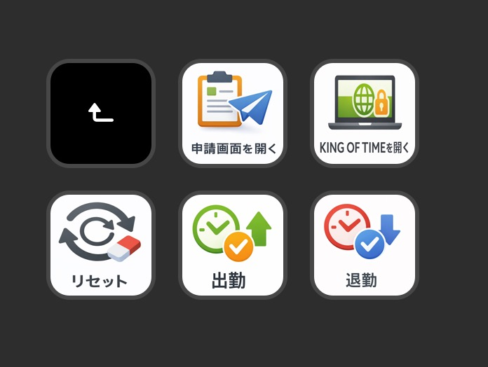

# KOT Punch

> Stream Deck から KING OF TIME の打刻と関連画面の起動をワンボタンで実行する macOS 向けプラグイン


## 確認環境

- Stream Deck アプリ: 7.3.0（build 22599）
- OS: macOS 26.3（build 25D125）
- デバイス: Keypad 操作に対応した Stream Deck
- 開発ツール: `bun`

## できること

- `出勤`: KING OF TIME の出勤打刻を実行
- `退勤`: KING OF TIME の退勤打刻を実行
- `KING OF TIMEを開く`: JWT 認証済みの KOT 勤怠画面を Chrome で開く
- `申請画面を開く`: 申請画面にログイン済みの Chrome を開く
- `リセット`: 出勤・退勤ボタンの打刻済み state を未打刻に戻す
- 各アクション成功時に macOS 通知を表示

## ドキュメント(自動生成)

- [docs/spec.md](./docs/spec.md): アプリ全体の機能要件

## 配置サンプル



## インストール

現行リポジトリは Marketplace 配布ではなく、ローカルビルドして `sdPlugin` ディレクトリを配置する前提です。

1. 依存関係をインストールする

```bash
bun install
```

`postinstall` で `bun run install-browser` が実行され、`Chrome for Testing` が未導入なら自動でインストールされます。

2. 開発用 `.env` を作成する

```bash
cp .env.example .env
```

3. プラグインをビルドする

```bash
bun run build
```

4. 生成された `com.hrk-m.kot-punch.sdPlugin` を Stream Deck のプラグインディレクトリに配置する

```bash
~/Library/Application Support/com.elgato.StreamDeck/Plugins/
```

5. Stream Deck アプリを再起動して `KOT Punch` を読み込む

## 設定方法

1. Stream Deck に `KOT Punch` のアクションを配置する
2. Property Inspector で必要なグローバル設定を入力する
3. 用途に応じて各アクションを使い分ける

### グローバル設定

| 設定項目 | 説明 | 利用アクション |
|---|---|---|
| `kotPunchUrl` | KOT 勤怠 / 打刻画面の URL | `出勤` / `退勤` / `KING OF TIMEを開く` |
| `kotPunchKey` | JWT トークンの Key | `出勤` / `退勤` / `KING OF TIMEを開く` |
| `kotPunchToken` | JWT トークンの Value | `出勤` / `退勤` / `KING OF TIMEを開く` |
| `kotPunchUsername` | 打刻ユーザー名 | `出勤` / `退勤` |
| `kotPunchPassword` | 打刻パスワード | `出勤` / `退勤` |
| `requestUrl` | 申請画面ログイン URL | `申請画面を開く` |
| `requestUsername` | 申請画面ログインユーザー名 | `申請画面を開く` |
| `requestPassword` | 申請画面ログインパスワード | `申請画面を開く` |

### アクション一覧

```json
{
  "Actions": [
    { "UUID": "com.hrk-m.kot-punch.clock-in", "Name": "出勤" },
    { "UUID": "com.hrk-m.kot-punch.clock-out", "Name": "退勤" },
    { "UUID": "com.hrk-m.kot-punch.open-kot", "Name": "KING OF TIMEを開く" },
    { "UUID": "com.hrk-m.kot-punch.open-request", "Name": "申請画面を開く" },
    { "UUID": "com.hrk-m.kot-punch.reset-punch-state", "Name": "リセット" }
  ]
}
```

### 打刻ボタンの挙動

- `出勤` / `退勤` は短押しで打刻を実行する
- 打刻済み state のときは短押しで何もしない
- 2 秒長押しすると state を手動で切り替える
- state はセッション内のみ保持し、プラグイン再起動でリセットされる

## 開発用設定

`.env` では `KOT_PUNCH_DEBUG` を切り替えられます。

| 変数名 | 値 | 説明 |
|---|---|---|
| `KOT_PUNCH_DEBUG` | `true` / `false` | `true` のとき submit をスキップし、パスワード入力後の状態でブラウザを切断する |

```dotenv
KOT_PUNCH_DEBUG=true
```

- 値はビルド時に確定する
- `.env` を変更したあとは `bun run build` が必要

## 開発コマンド

```bash
bun run lint
bun run typecheck
bun run test
bun run build
```

変更前の最小確認:

```bash
bun run lint && bun run test && bun run typecheck && bun run build
```

## トラブルシューティング

### `Could not find Chrome (ver. ...)` が出る場合

1. 依存関係を入れ直す

```bash
bun install
```

2. 必要な `Chrome for Testing` を確認する

```bash
bun run install-browser
```

3. プラグインを再ビルドする

```bash
bun run build
```

4. ログを確認する

```bash
bun run logs
```
