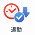

# Spec: 打刻ボタン（Clock In / Clock Out）

## 概要

Stream Deck のボタンを押すだけで出勤・退勤打刻を実行するアクション群。Puppeteer で KOT 打刻ページを自動操作し、ワンボタンで打刻を完結させる。

---

## 前提条件

- グローバル設定に `kotPunchUrl` / `kotPunchKey` / `kotPunchToken` / `kotPunchUsername` / `kotPunchPassword` が設定済みであること
- Stream Deck プラグインが起動していること

---

## 入力・出力

| 項目 | 型 | 説明 |
|------|----|------|
| 入力: `onKeyDown` イベント | `KeyDownEvent` | Stream Deck のキー押下開始操作。長押し判定の起点 |
| 入力: `onKeyUp` イベント | `KeyUpEvent` | Stream Deck のキー離し操作 |
| 入力: グローバル設定 | `KotPunchSettings` | `kotPunchUrl` / `kotPunchKey` / `kotPunchToken` / `kotPunchUsername` / `kotPunchPassword` |
| 入力: 環境変数 | `process.env.KOT_PUNCH_DEBUG` | `"true"` のとき dryRun 有効（submit スキップ）。ビルド時に inline 展開される（デフォルト `"false"`） |
| 出力 | `void` | 副作用として打刻を実行し、UI 状態を更新する |

---

## 主フロー（正常系）

```
ボタン押下（onKeyDown）
  │
  ├─ 処理中フラグチェック → 処理中なら即 return
  └─ 2 秒タイマーを開始

2 秒到達
  │
  └─ State 0/1 を手動で反転してアイコンを即時更新

ボタンを離す（onKeyUp）
  │
  ├─ 処理中フラグチェック → 処理中なら即 return
  ├─ 長押しトラッカーを解放
  ├─ 長押し成立済み
  │    └─ no-op で return
  ├─ State 1 の短押し
  │    └─ no-op で return
  ├─ グローバル設定取得
  ├─ 必須項目チェック → 未入力なら showAlert()
  │
  └─ Puppeteer 起動
       ├─ JWT トークンをセット
       ├─ 打刻ページに遷移
       ├─ ユーザー選択・パスワード入力
       ├─ KOT_PUNCH_DEBUG="true" でなければ submit
       ├─ 成功: showOk() + setState(1)
       └─ notify("出勤打刻が完了しました") / notify("退勤打刻が完了しました")
```

---

## 異常系・エラー処理

| エラー条件 | 対応 |
|---|---|
| 必須設定が未入力 | `notify("全項目必須です。設定を確認してください。")` + `showAlert()` を表示して処理を中断 |
| 認証失敗（ダイアログ検出） | ブラウザを閉じてエラーを throw → `showErrorImage()` + `setState(0)` |
| Puppeteer 操作エラー | `showErrorImage()` でエラー画像を 3 秒表示後 `setState(0)` にリセット |
| 長押し state 更新 | エラー扱いにしない。`setState()` のみ実行し打刻処理は開始しない |

---

## 状態遷移

| 状態 | 説明 | 遷移条件 |
|------|------|---------|
| State 0 | 未打刻（通常アイコン） | 初期状態 / エラー後リセット / State 1 での 2 秒長押し |
| State 1 | 打刻済み（チェックマークアイコン） | 打刻成功後（`showOk()` + `setState(1)`）/ State 0 での 2 秒長押し |

---

## 制約・非機能要件

- 連打防止: `_isProcessing` フラグで処理中の重複実行を防ぐ
- dryRun モード: `.env` の `KOT_PUNCH_DEBUG=true` でビルドした場合は submit をスキップし、パスワード入力まで確認できる状態でブラウザを切断する。デフォルト（未設定）および `.env.example` コピー直後は `false`（本番打刻有効）
- State はセッション内のみ保持（プラグイン再起動でリセット）、当日限りの打刻管理として意図的に非永続化
- 長押しの閾値は 2 秒固定で、2 秒到達前のタイトル変更や進捗表示は行わない
- Multi-Action は未対応: `manifest.template.json` で `SupportedInMultiActions: false` を設定し、状態遷移は単体キー押下だけを前提にする

---

## エッジケース・境界条件

| ケース | 挙動 |
|--------|------|
| State 0 で 2 秒到達まで押し続けた場合 | 2 秒到達時点で `setState(1)` のみ実行し、離したときは no-op |
| State 1 を短押しした場合 | no-op で終了し、State は変わらない |
| State 1 で 2 秒到達まで押し続けた場合 | 2 秒到達時点で `setState(0)` のみ実行し、離したときは no-op |
| 処理中に再度ボタンを押した場合 | `_isProcessing` フラグにより即 `return` |
| `KOT_PUNCH_DEBUG=true` を `.env` に設定してビルドした場合 | submit をスキップし、ブラウザを `disconnect()` のみで終了（動作確認用） |
| `kotPunchUsername` に `"` や `\` を含む場合 | CSS 属性セレクタ用にエスケープしてからユーザー候補の待機・クリックを行う |

---

## ボタン・アイコン一覧

この機能でユーザーが押すボタンと、対応する action/state を示す。

| ボタン | 状態 | アイコン | パス | 説明 |
|--------|------|----------|------|------|
| `出勤` | `Clock In` / State 0 |  | `../../com.hrk-m.kot-punch.sdPlugin/imgs/actions/attend/key.png` | 未打刻状態の出勤ボタン。短押しで出勤打刻を実行する |
| `出勤` | `Clock In` / State 1 |  | `../../com.hrk-m.kot-punch.sdPlugin/imgs/actions/attend/key1.png` | 打刻済み状態の出勤ボタン。短押しは no-op、2 秒長押しで State 0 に戻す |
| `退勤` | `Clock Out` / State 0 |  | `../../com.hrk-m.kot-punch.sdPlugin/imgs/actions/leave/key.png` | 未打刻状態の退勤ボタン。短押しで退勤打刻を実行する |
| `退勤` | `Clock Out` / State 1 |  | `../../com.hrk-m.kot-punch.sdPlugin/imgs/actions/leave/key1.png` | 打刻済み状態の退勤ボタン。短押しは no-op、2 秒長押しで State 0 に戻す |
| `出勤` / `退勤` | Error（共通） |  | `../../com.hrk-m.kot-punch.sdPlugin/imgs/actions/common/error.png` | 打刻失敗時に `showErrorImage()` が 3 秒表示する共通 error icon |

---

## 依存関係

| 依存先 | 用途 |
|--------|------|
| `actions/punch/base-punch-action.ts` | `BasePunchAction` — `ClockIn` / `ClockOut` 共通の `_isProcessing` フラグ・長押し判定・`onKeyDown` / `onKeyUp` をまとめた抽象基底クラス |
| `services/kot/punch.ts` | `punchKot(selector, settings)` — Puppeteer 起動・打刻操作 |
| `platform/streamdeck/settings/punch-settings.ts` | `getGlobalSettings()` / `hasRequiredPunchSettings()` — 設定取得・バリデーション |
| `shared/long-press.ts` | `createPressTracker()` / `LONG_PRESS_THRESHOLD_MS` — 2 秒タイマー開始・解除・成立済み状態を管理する共通 helper |
| `platform/streamdeck/show-error-image.ts` | `showErrorImage(action)` — エラー画像表示ユーティリティ |
| `platform/desktop/notify.ts` | `notify(message)` — 成功時の macOS 通知（fire-and-forget） |
| KING OF TIME（外部） | 打刻対象のウェブサービス |
